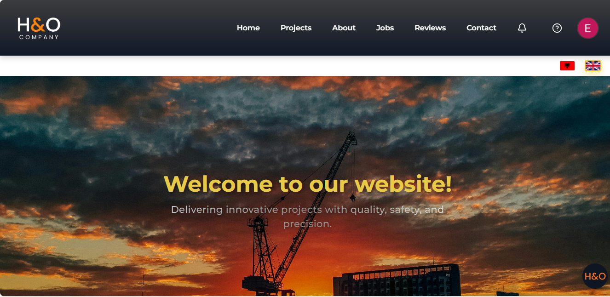
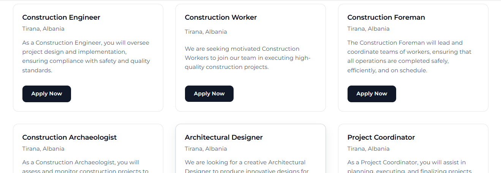
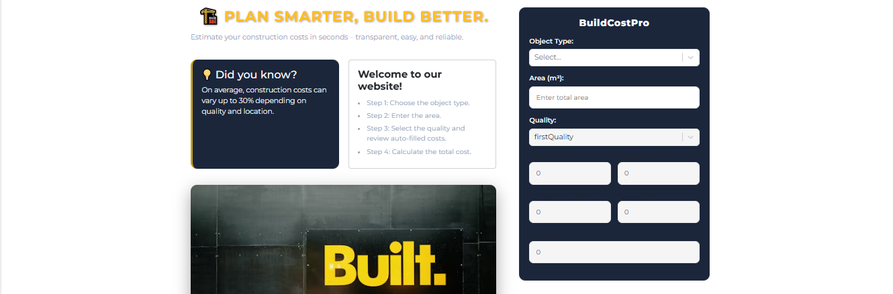
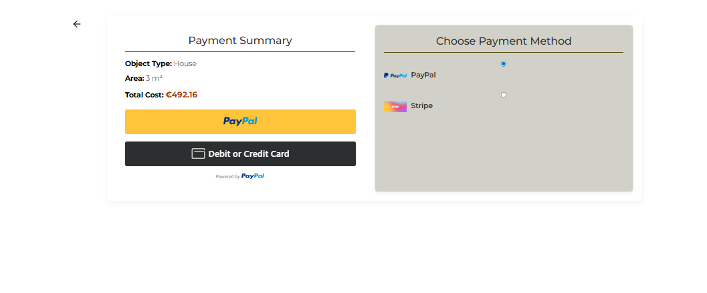

<div align="center">

<h1>H&amp;O Company — Construction Business Platform</h1>

<p>
  
  
  
  
  
  
</p>

<p>
  A production-ready web platform designed to manage construction company operations, internal workflows, and customer interactions.
</p>

<p>
  <b>Live Demo:</b> <a href="https://hocompany1.com">https://hocompany1.com</a>
</p>

</div>

<hr />

<h2>Overview</h2>

<p>
H&amp;O Company centralizes construction-related workflows into a single platform, reducing reliance on fragmented tools and manual processes.
The system supports both <b>public users</b> and <b>administrative roles</b>, with clear separation of concerns and predictable data flow.
</p>

<hr />

<h2>Core Capabilities</h2>

<ul>
  <li>User authentication with Google OAuth</li>
  <li>Job application submission and tracking</li>
  <li>Role-based access control (admin / user)</li>
  <li>Administrative dashboard</li>
  <li>Calendar-based scheduling</li>
  <li>Secure online payments (PayPal)</li>
  <li>Customer reviews and ratings</li>
  <li>Responsive layout for desktop and mobile devices</li>
</ul>

<hr />

<h2>Architecture</h2>

<ul>
  <li><b>Frontend:</b> React (component-driven architecture)</li>
  <li><b>Backend:</b> RESTful PHP API</li>
  <li><b>Database:</b> MySQL</li>
  <li><b>Authentication:</b> Firebase + Google OAuth</li>
  <li><b>Payments:</b> PayPal</li>
  <li><b>State Management:</b> React Context + custom hooks</li>
  <li><b>API Communication:</b> Axios</li>
  <li><b>Scheduling:</b> React Big Calendar</li>
</ul>

<p>
The architecture emphasizes modularity, separation of concerns, and ease of future extension.
</p>

<hr />

<h2>Development Principles</h2>

<ul>
  <li>Clean and predictable data flow</li>
  <li>Reusable and isolated UI components</li>
  <li>Explicit loading and error handling</li>
  <li>Responsive and accessible UI</li>
  <li>Configuration-driven environment setup</li>
</ul>

<hr />

<h2>Team Workflow</h2>

<p>
This project follows a team-oriented development workflow inspired by real-world engineering practices:
</p>

<ul>
  <li>Feature-based branching (<code>feature/*</code>, <code>fix/*</code>, <code>docs/*</code>)</li>
  <li>Pull Requests for all changes</li>
  <li>Conventional commit messages</li>
  <li>Stable <code>main</code> branch</li>
  <li>Documentation treated as part of the product</li>
</ul>

<h3>Branching Strategy</h3>
<ul>
  <li><code>main</code> — production-ready code</li>
  <li><code>feature/*</code> — new features</li>
  <li><code>fix/*</code> — bug fixes</li>
  <li><code>docs/*</code> — documentation changes</li>
</ul>

<hr />

<h2>Application Preview</h2>

<p>Selected screenshots from the application.</p>

<table>
  <tr>
    <td align="center">
      
      <br />
      <sub><b>Dashboard Overview</b></sub>
    </td>
    <td align="center">
      
      <br />
      <sub><b>Job Application Flow</b></sub>
    </td>
  </tr>
  <tr>
    <td align="center">
      
      <br />
      <sub><b>Admin Panel</b></sub>
    </td>
    <td align="center">
      
      <br />
      <sub><b>Payment Flow</b></sub>
    </td>
  </tr>
  <tr>
    <td colspan="2" align="center">
      
      <br />
      <sub><b>Customer Reviews</b></sub>
    </td>
  </tr>
</table>

<hr />

<h2>Project Structure</h2>

```text
api/                → PHP REST API
public/             → Static assets
src/
 ├─ components/     → Reusable UI components
 ├─ pages/          → Application pages
 ├─ features/       → Feature-based modules
 ├─ hooks/          → Custom React hooks
 ├─ context/        → Global state management
 ├─ styles/         → Styling
 ├─ App.js          → Application entry point
 ├─ index.js        → ReactDOM render
 └─ firebase.js     → Firebase configuration
screenshots/        → Application screenshots
.env.example        → Environment variables template

<hr />```

<h2>Installation &amp; Setup</h2>

<h3>Clone the repository</h3>

<pre><code>
git clone https://github.com/EraCodeX/hco-company-platform.git
cd hco-company-platform
</code></pre>

<h3>Install dependencies</h3>

<pre><code>
npm install
# or
yarn
</code></pre>

<h3>Environment configuration</h3>

<p>
Create a <code>.env</code> file at the project root using
<code>.env.example</code> as reference.
</p>

<pre><code>
REACT_APP_FIREBASE_API_KEY=your_api_key
REACT_APP_FIREBASE_AUTH_DOMAIN=your_auth_domain
REACT_APP_FIREBASE_PROJECT_ID=your_project_id
REACT_APP_PAYPAL_CLIENT_ID=your_paypal_client_id
</code></pre>

<h3>Run locally</h3>

<pre><code>
npm start
# or
yarn start
</code></pre>
