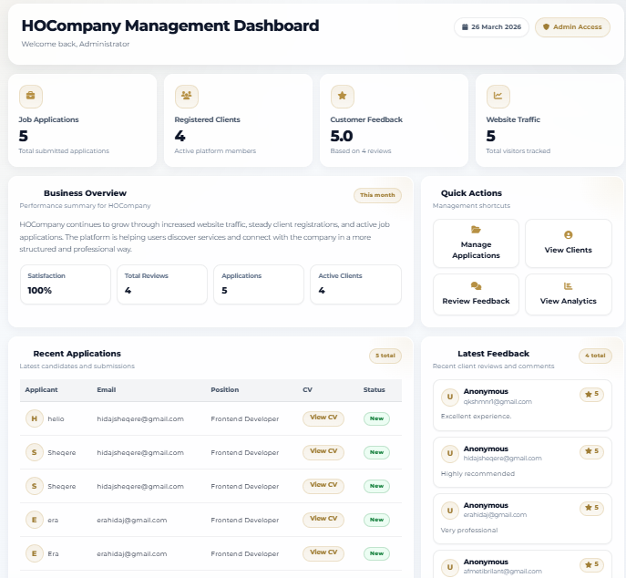
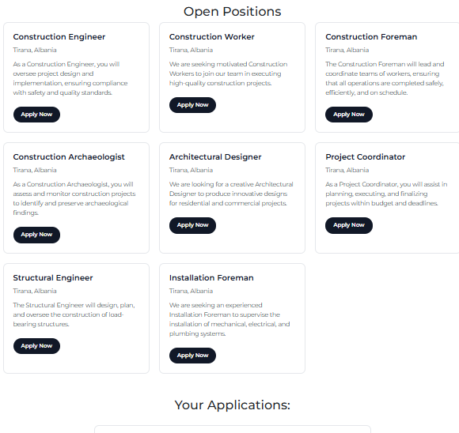
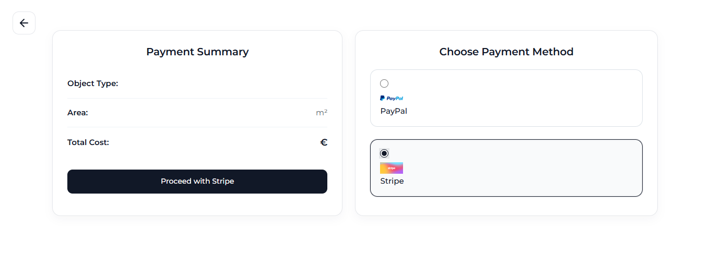

# H&O Company — Construction Business Platform


**Production-ready web platform designed to digitalize construction company operations, customer interactions, and internal workflows.**

This project reflects a real-world business application built with **scalability, maintainability, and performance in mind** — not a demo or tutorial project.

🌐 **Live Demo:** [hocompany1.com](https://hocompany1.com/)

---

## 📸 Application Preview

<table align="center">
  <tr>
    <td></td>
    <td></td>
  </tr>

  <tr>
    <td></td>
    <td></td>
  </tr>
</table>

<p align="center">
  
</p>

## 🧩 Business Context

Construction companies typically manage job applications, scheduling, payments, and customer communication through disconnected tools or manual processes.

This fragmentation leads to:

- operational inefficiency
- lack of visibility
- poor user experience for both clients and administrators

---

## 💡 Solution Overview

H&O Company centralizes these workflows into a single web platform that enables:

- Structured job application management
- Role-based access and administration
- Scheduling and calendar coordination
- Secure online payments
- Transparent ratings and feedback

The focus is on **real usability, clean UX, and long-term maintainability**, similar to production environments.

---

## ⚙️ Technical Architecture & Decisions

- **React** for a modular, component-driven frontend architecture
- **RESTful PHP API** with **MySQL** for backend data handling
- **Axios** for API communication
- **React Context + custom hooks** for state management
- **Google OAuth** for authentication
- **PayPal integration** for payments
- **React Big Calendar** for scheduling

**Development priorities:**

- Predictable data flow
- Reusable and isolated components
- Proper loading and error handling
- Responsive design across devices

---

## ✨ Core Functionality

- Google authentication
- Job application submission & tracking
- Role-based UI (Admin / User)
- Ratings & feedback system
- Calendar scheduling
- Secure payment handling

---

## 📁 Project Structure

```text
api/                # PHP REST API
public/             # Static assets

src/
 ├─ components/
 ├─ pages/
 ├─ features/
 ├─ hooks/
 ├─ context/
 ├─ styles/
 ├─ App.js
 ├─ index.js
 └─ firebase.js

screenshots/
.env.example

```

## 💻 Installation & Setup

### 1. Clone Repository

```
git clone https://github.com/EraCodeX/hco-company-platform.git
cd hco-company-platform


```

2. Install Dependencies

```
npm install
```

3. Setup Environment Variables

```
Create a .env file at the project root:

- REACT_APP_FIREBASE_API_KEY=your_api_key
- REACT_APP_FIREBASE_AUTH_DOMAIN=your_auth_domain
- REACT_APP_FIREBASE_PROJECT_ID=your_project_id
- REACT_APP_PAYPAL_CLIENT_ID=your_paypal_client_id

```

4. Run Locally

```
npm start
```
